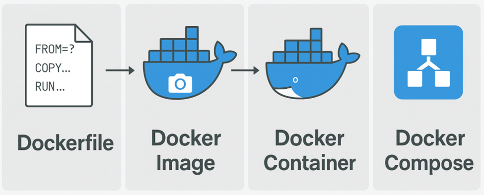
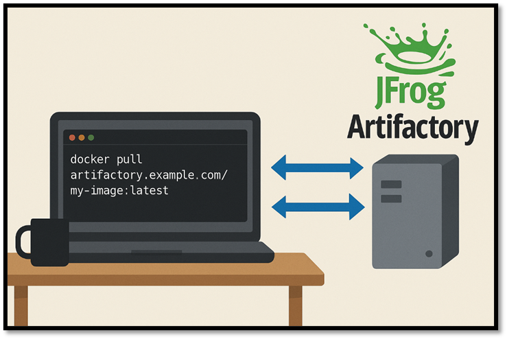
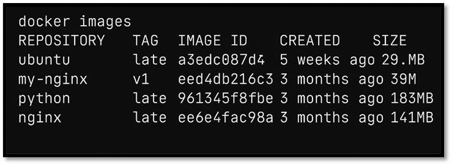

# Introduction

The following repository is intended as a quick guide to the basic docker concepts. The target audience of the guide is
developer with no or minimal experience with docker.
Advanced topics are intentionally kept out of the guide to keep the focus on the primary use cases.

In the end of the guide you will find a “docker cli”- and “docker compose cli”-cheat sheet.

# Table of Content

<!-- TOC -->
* [Introduction](#introduction)
* [Table of Content](#table-of-content)
* [What is Docker?](#what-is-docker)
* [Anatomy](#anatomy-)
  * [Dockerfile](#dockerfile)
    * [Dockerfile script commands](#dockerfile-script-commands)
    * [Docker cli (Dockerfile related)](#docker-cli-dockerfile-related)
  * [Docker image](#docker-image)
    * [Docker cli (Docker image related)](#docker-cli-docker-image-related)
  * [Docker container](#docker-container)
    * [Docker cli (Docker container related)](#docker-cli-docker-container-related)
  * [Docker compose](#docker-compose)
    * [Docker compose cli](#docker-compose-cli-)
* [Cheat sheet](#cheat-sheet)
    * [Dockerfile script commands](#dockerfile-script-commands-1)
    * [Docker cli](#docker-cli)
    * [Docker compose cli](#docker-compose-cli)
<!-- TOC -->

# What is Docker?

Docker is a containerization platform that packages applications and their dependencies into lightweight, portable
containers that run consistently across environments.
It uses isolated file systems, networking, and processes to ensure reproducible deployments without conflicts.
Containers are built from layered images, enabling efficient versioning, distribution, and scaling.

# Anatomy 
The diagram below show the four primary concepts for Docker which will be necessary for any developer to understand.
Dockerfile, Docker image, Docker container and Docker compose. 
In the following subsections will afterward dive into each concept more extensively. 



## Dockerfile

A Dockerfile is a text-based script containing step-by-step instructions for building a Docker image.
Each command—such as FROM, COPY, and RUN—creates a new layer that defines how the final image should be configured.
By automating the build process, a Dockerfile ensures consistent, repeatable environments across development, testing,
and production.

```
# Comment example
FROM python:3.10-slim
MAINTAINER Daniel Bjørnskov "daniel@example.com"
LABEL project="example-app" description="Demo Dockerfile"
ENV APP_ENV=production
WORKDIR /app
COPY requirements.txt /app/
RUN pip install --no-cache-dir -r requirements.txt
ADD src/ /app/src/
USER nobody
EXPOSE 8080
CMD ["python", "src/main.py"]
```
### Dockerfile script commands

| Command    |Purpose / Explanation                                                                            |
|:-----------|----------------------------------------------------------------------------|
| FROM       | Defines the base image from which your image is built.                     |
| MAINTAINER | Specifies the image author (deprecated—LABEL is preferred).                |
| LABEL      | Adds metadata to the image such as project info, description.              |
| ENV        | Sets environment variables available inside the container.                 |
| WORKDIR    | Sets the working directory for subsequent commands (RUN, CMD, COPY, etc.). |
| COPY       | Copies files or directories from the host into the container.              |
| RUN        | Executes commands during the build, creating new image layers.             |
| ADD        | Similar to COPY but supports URLs and automatically extracts archives.     |
| USER       | Sets which user will run commands and the container process.               |
| EXPOSE     | Documents the port the container listens on at runtime.                    |
| CMD        | Specifies the default command executed when the container starts.          |


### Docker cli (Dockerfile related)

| Command <br/>`docker <command>` | Purpose / Explanation                                           |
|---------------------------------|-----------------------------------------------------------------|
| build                           | Creates a Docker image from a Dockerfile and context directory. |

## Docker image
A Docker image is a read-only, versioned template that contains all the files, libraries, dependencies, and configuration needed to run an application. 
It is built from a Dockerfile, where each instruction creates a new immutable layer in the image. 
When you start a container, Docker uses this image as the blueprint to create a runnable, isolated environment.




### Docker cli (Docker image related)

| Command <br/>`docker <command>` | Purpose / Explanation                                                                                 |
|---------------------------------|-------------------------------------------------------------------------------------------------------|
| pull                            | Downloads an image from a container registry (e.g., Docker Hub or Artifactory) to your local machine. |
| push                            | Uploads a local image to a registry, making it available for others or deployments.                   |
| save                            | Exports an image to a tar archive file (useful for offline transfer).                                 |
| load                            | Imports an image from a tar archive created with docker save.                                         |
| tag                             | Assigns a new name or tag to an existing image, often used before pushing.                            |
| prune                           | Removes unused images, containers, volumes, or networks to free disk space.                           |
| commit                          | Creates a new image from a running container’s current state.                                         |

## Docker container
A Docker container is a lightweight, isolated runtime environment created from a Docker image, containing everything an application needs to run. 
It shares the kernel of the host node, but operates in its own segregated space with isolated file system, processes, and networking. 
This allows multiple containers to run reliably and efficiently on the same host node without interfering with each other.

### Docker cli (Docker container related)

| Command <br/>`docker <command>` | Purpose / Explanation                                                                      |
|---------------------------------|--------------------------------------------------------------------------------------------|
| run                             | Creates and starts a new container from an image.                                          |
| -v                              | Mounts a volume: host_path:container_path — allows persistence and file sharing.           |
| -it                             | Combines -i (keep STDIN open) and -t (allocate a pseudo-TTY); used for interactive shells. |
| -d                              | Runs the container in detached mode (in the background).                                   |
| -p                              | Publishes a container port to the host: host_port:container_port.                          |
| exec                            | Runs a command inside a running container (often used with -it for a shell).               |
| rm                              | Deletes one or more stopped containers.                                                    |
| start                           | Starts one or more existing (stopped) containers.                                          |
| stop                            | Gracefully stops one or more running containers.                                           |
| ps                              | Lists running containers; use -a to show all containers.                                   |
| cp                              | Copies files/folders between host and container (both directions).                         |
| rename                          | Renames an existing container.                                                             |

## Docker compose
Docker Compose is a tool that allows you to define and manage multi-container applications using a single YAML file. 
It enables you to describe services, networks, and volumes in one place and start them all together with a single command. 
By coordinating multiple containers on the same host, Docker Compose simplifies development, testing, and deployment of complex, service-based systems.

```
version: "3.9"

services:
  web:
    image: python:3.10-slim
    container_name: my-web-app
    working_dir: /app
    volumes:
      - ./app:/app
    ports:
      - "8080:8080"
    command: ["python", "app.py"]

  redis:
    image: redis:alpine
    container_name: my-redis
    ports:
      - "6379:6379"
```

### Docker compose cli 

| Command <br/>`docker compose <command>` | Purpose / Explanation                                                     |
|-----------------------------------------|---------------------------------------------------------------------------|
| up                                      | Builds (if needed) and starts all services defined in docker-compose.yml. |
| down                                    | Stops and removes containers, networks, and optionally volumes.           |
| logs                                    | Shows logs from all or specific services.                                 |
| start                                   | Starts existing stopped service containers.                               |
| stop                                    | Stops running service containers.                                         |
| build                                   | Builds or rebuilds images defined in the Compose file.                    |
| exec                                    | Runs a command inside a running service container.                        |
| ps                                      | Lists all containers managed by Compose.                                  |

# Cheat sheet
### Dockerfile script commands

| Command    |Purpose / Explanation                                                                            |
|:-----------|----------------------------------------------------------------------------|
| FROM       | Defines the base image from which your image is built.                     |
| MAINTAINER | Specifies the image author (deprecated—LABEL is preferred).                |
| LABEL      | Adds metadata to the image such as project info, description.              |
| ENV        | Sets environment variables available inside the container.                 |
| WORKDIR    | Sets the working directory for subsequent commands (RUN, CMD, COPY, etc.). |
| COPY       | Copies files or directories from the host into the container.              |
| RUN        | Executes commands during the build, creating new image layers.             |
| ADD        | Similar to COPY but supports URLs and automatically extracts archives.     |
| USER       | Sets which user will run commands and the container process.               |
| EXPOSE     | Documents the port the container listens on at runtime.                    |
| CMD        | Specifies the default command executed when the container starts.          |

### Docker cli

| Command <br/>`docker <command>` | Purpose / Explanation                                           |
|---------------------------------|-----------------------------------------------------------------|
| build                           | Creates a Docker image from a Dockerfile and context directory. |
| pull                            | Downloads an image from a container registry (e.g., Docker Hub or Artifactory) to your local machine. |
| push                            | Uploads a local image to a registry, making it available for others or deployments.                   |
| save                            | Exports an image to a tar archive file (useful for offline transfer).                                 |
| load                            | Imports an image from a tar archive created with docker save.                                         |
| tag                             | Assigns a new name or tag to an existing image, often used before pushing.                            |
| prune                           | Removes unused images, containers, volumes, or networks to free disk space.                           |
| commit                          | Creates a new image from a running container’s current state.                                         |
| run                             | Creates and starts a new container from an image.                                          |
| -v                              | Mounts a volume: host_path:container_path — allows persistence and file sharing.           |
| -it                             | Combines -i (keep STDIN open) and -t (allocate a pseudo-TTY); used for interactive shells. |
| -d                              | Runs the container in detached mode (in the background).                                   |
| -p                              | Publishes a container port to the host: host_port:container_port.                          |
| exec                            | Runs a command inside a running container (often used with -it for a shell).               |
| rm                              | Deletes one or more stopped containers.                                                    |
| start                           | Starts one or more existing (stopped) containers.                                          |
| stop                            | Gracefully stops one or more running containers.                                           |
| ps                              | Lists running containers; use -a to show all containers.                                   |
| cp                              | Copies files/folders between host and container (both directions).                         |
| rename                          | Renames an existing container.                                                             |

### Docker compose cli

| Command <br/>`docker compose <command>` | Purpose / Explanation                                                     |
|-----------------------------------------|---------------------------------------------------------------------------|
| up                                      | Builds (if needed) and starts all services defined in docker-compose.yml. |
| down                                    | Stops and removes containers, networks, and optionally volumes.           |
| logs                                    | Shows logs from all or specific services.                                 |
| start                                   | Starts existing stopped service containers.                               |
| stop                                    | Stops running service containers.                                         |
| build                                   | Builds or rebuilds images defined in the Compose file.                    |
| exec                                    | Runs a command inside a running service container.                        |
| ps                                      | Lists all containers managed by Compose.                                  |
